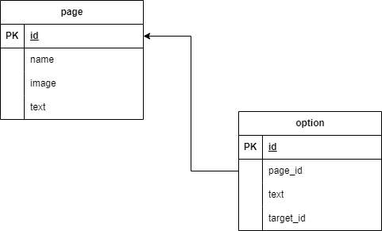

# Instruktioner

Gör en fork av detta repo och klona ner det till din dator. Installera sedan alla dependencies med `npm install`.

```bash
cd /path/to/your/fork
npm install
```

Du kan nu starta projektet med `npm run dev` och öppna det i din webbläsare på `http://localhost:3000`.

## Teknik

Som tidigare kör vi express som server och med nunjucks som templating engine.

# Databas

Börja med att skapa en ny branch, databas.
För att arbeta med databasen kommer vi att behöva några paket.

* mysql2, mysql driver för node
* dotenv, för att läsa in miljövariabler från en .env fil

## Installera paket

För att installera paketen skriver du `npm install mysql2 dotenv` i terminalen.

## Skapa databas

En databas är skapad för er på skolans server, informationen finns på classroom och inte här.
Eftersom vi inte vill dela informationen på github så kommer vi att använda oss av en .env fil.

**OBS! .env filen ska inte läggas upp på github, den ska vara med i .gitignore. Undersök därför om en .gitignore fil finns i projektet, om inte skapa en och lägg till .env i den.**

Skapa en fil som heter .env i rooten av projektet och lägg till följande:

```bash
DATABASE_HOST=
DATABASE_USERNAME=
DATABASE_PASSWORD=
DATABASE_DATABASE=
```

### Tableplus

För att enklare arbeta mot databasen så kan ni installera [Tableplus](https://tableplus.com/), ett program för att arbeta med databaser. Det finns en gratisversion som räcker gott och väl för våra behov.

## Ansluta till databasen

**Viktigt att ladda in .env filen innan vi ansluter till databasen.**

I server.js lägg till följande på rad 1:
```javascript
require('dotenv').config()
```

Nu när vi har skapat databasen och lagt till informationen i .env filen så kan vi ansluta till databasen.

Skapa en fil som heter db.js i rooten av projektet och lägg till följande:

```javascript
const mysql = require('mysql2');

const pool = mysql.createPool({
    connectionLimit: 10,
    waitForConnections: true,
    queueLimit: 0,
    charset: 'utf8mb4',
    host: process.env.DATABASE_HOST,
    user: process.env.DATABASE_USERNAME,
    password: process.env.DATABASE_PASSWORD,
    database: process.env.DATABASE_DATABASE,
});

module.exports = pool;
```

## Testa anslutningen

Nu när vi har skapat databasen och lagt till informationen i .env filen så kan vi ansluta till databasen.

Skapa en fil som heter db.js i rooten av projektet och lägg till följande:

```javascript
const pool = require('./db');
```

## För att spara data och arbeta mot databasen behöver vi skapa tabeller

Öppna tableplus för detta, det är enklast. Du ska skapa två tabeller i databasen, dessa ska vara kopplade till den data vi använt för att skriva vår berättelse.

```json
  "parts": [
    {
      "id": 0,
      "name": "rubrik",
      "image": "bild om den finns.jpg",
      "text": "Paragraf text om äventyret",
      "options": [
        {
          "id": 1,
          "text": "Val ett",
          "target": 1
        },
        {
          "id": 2,
          "text": "Val två",
          "target": 2
        }
      ]
    }
```

Vi behöver skapa tabeller för att representera detta objekt. Vi behöver en tabell för parts och en för options.



Öppna tableplus och skapa tabellerna. 

### Part

Parts tabellen ska ha följande kolumner:

* id, bigint unsigned, primary key, auto increment
* name, varchar(255)
* image, varchar(255)
* text, text

### Option

Options tabellen ska ha följande kolumner:

* id, bigint unsigned, primary key, auto increment
* part_id, bigint unsigned
* text, varchar(255)
* target_id, bigint unsigned

## Skapa en route för att hämta data från databasen

För att hämta data från databasen behöver vi skapa en route. Skapa en fil som heter story.js (detta så vi kan hålla isär index och story router som kommer använda databasen) i routes mappen och lägg till följande:

```javascript
const express = require('express');
const router = express.Router();
const pool = require('../db');

router.get('/', async (req, res) => {
    try {
        const [parts] = await pool.promise().query('SELECT * FROM part');
        const [options] = await pool.promise().query('SELECT * FROM option');
        res.json({ parts, options });
    } catch (error) {
        console.log(error);
        res.sendStatus(500);
    }
});

module.exports = router;
```

Detta dumpar enbart ut all data från databasen, vi kommer att behöva göra en del förändringar för att få ut rätt data.

## Skapa en route för att hämta en del av berättelsen

```javascript
router.get('/:id', async (req, res) => {
  try {
    const [part] = await pool
      .promise()
      .query('SELECT * FROM jens_part WHERE id = ?', [req.params.id])
    const [options] = await pool
      .promise()
      .query('SELECT * FROM jens_option WHERE part_id = ?', [req.params.id])
    res.json({ ...part[0], options })
  } catch (error) {
    console.log(error)
    res.sendStatus(500)
  }
})
```

Här formaterar vi om datan så att vi får ut en del av berättelsen med tillhörande val.

Alternativ med JOIN:

```javascript
      .query(
        'SELECT * FROM jens_part JOIN jens_option ON jens_part.id = jens_option.part_id WHERE jens_part.id = ?',
        [req.params.id]
      )
    res.json({ part })
```

## Uppgift 

Nu när vi har en route för att hämta en del av berättelsen så kan vi börja bygga vår berättelse. Skapa data i databasen som motsvarar den data vi har i story.json.

Se sedan till att allt fungerar med hämtandet av data från databasen.

### Extra

* Skapa en tabell för användare och lägg till en route för att skapa en användare. Användaren ska sparas i databasen.
* Nu kan spelaren spara sin position i berättelsen. Skapa en route för att hämta en användare och dess position i berättelsen.